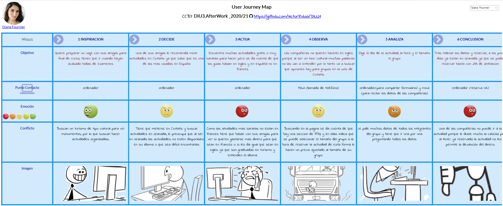

## DIU - Practica1, entregables

### Analisis de Competencia

El servicio que hemos elegido es Civitatis ya que es la web más importante en este sector, para poder así hacer una comparación más detallada con sus competidores.

En cuanto a Civitatis es una web de estilo minimalista y se observa cómo funciones básicas, como un buscador, no las posee. En todas las actividades dispone de un mapa donde muestra claramente el punto de encuentro. Tienen muchos feedbacks en las actividades. Su mayor desventaja es que no se puede seleccionar el idioma de la actividad.

Algunos de sus competidores que hemos encontrado son GetYourGuide y Walk in Granada.
GetYourGuide: Al meternos en la web se ve bastante sencilla y fácil pero nos condiciona mucho que tenemos que poner la fecha para encontrar un tour, se muestran muchas actividades y bastante bien descritas, una ventaja es que además de buscar actividades en Granada capital, también tiene organizadas las actividades por sus distintos barrios.

Walk in Granada: viendo la web nos damos cuenta de que es difícil encontrar las actividades en la página, hay poca variedad de actividades, no dispone de un buscador  ni tampoco se pueden seleccionar actividades por zonas.

### 2 Personas

Estas dos personas poseen las características básicas de usuarios que usan frecuentemente este tipo de servicios. Entre sí, podemos observar que tienen perfiles bastante diferentes, tales como su ubicación geográfica y su lengua, pero a su vez tienen la misma necesidad o dificultad, la de encontrar una excursión en Granada. Además tienen habilidades de usuario diferentes, ya que Esteban está muy familiarizado con el móvil pero no tiene mucha idea de usar software nuevo, ni tampoco es muy amigo de las tecnologías, mientras que Diana está bastante más familiarizada con la tecnología.

###2 JourneyMaps (1 por persona)

Diana Fournier:
Es una estudiante francesa que busca una actividad grupal en Granada para hacer con sus compañeras,  el problema que encuentra es que la gran mayoría de las actividades que hay no tienen la posibilidad de que sean en francés, las pocas que hay son muy caras, aunque finalmente reservan una de estas, el otro inconveniente que encuentran es que no se les devolvió el dinero correspondiente de la chica que no pudo ir porque estaba enferma.

Esteban Ramírez:
Este busca una excursión por Granada para hacer con su mujer, hay muchas posibilidades, pero como está la situación ahora decide buscar una que sea reembolsable por si por temas de restricciones en la movilidad no pueden acudir.

###Revision de Usalibilidad

La nota calculada es bastante alta y por esto pensamos que no se penaliza tanto como se debería en las faltas de funcionalidad que se cometen. Creemos que la puntuación total se decide en bastante medida por la parte de diseño de la interfaz y no tanto por las funciones que ofrece. En nuestra opinión, la revisión de usabilidad acierta en el aspecto visual, ya que como mencionamos en algunos comentarios, el sitio está muy claro y es muy visual, ayudando así al usuario a que su uso sea muy amigable. El sitio lo hace bien con esto mencionado, con la tipografía y el tipo de letra usado, con el rendimiento del sitio, pero carece funciones tan básicas como tener un buscador, poder solicitar ayuda, tener enlaces externos a sitios de interés o como tener una explicación de cómo rellenar el formulario adecuadamente
