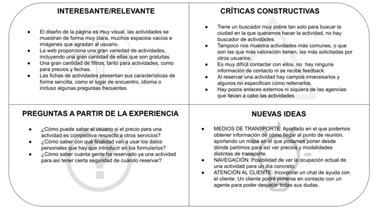
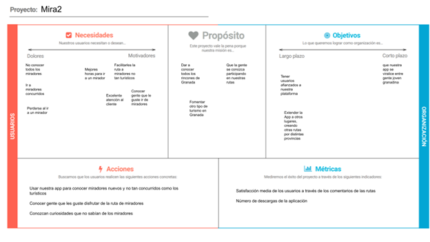
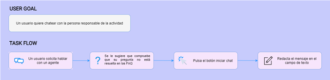
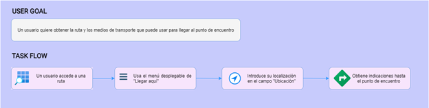
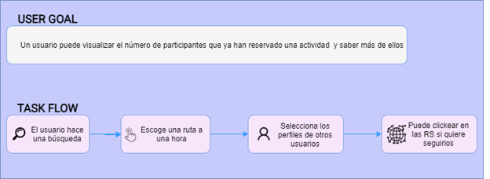
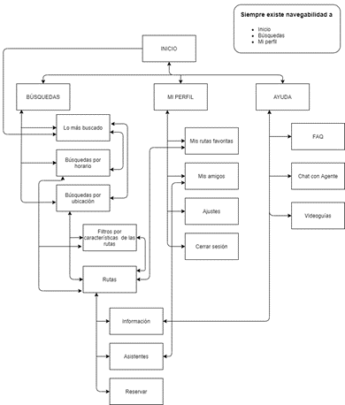
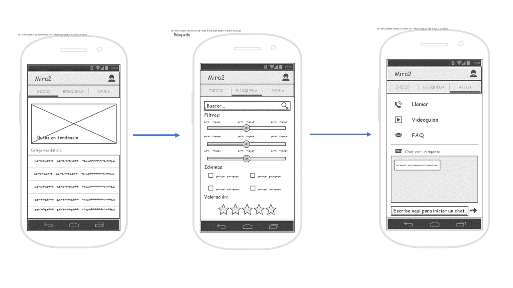
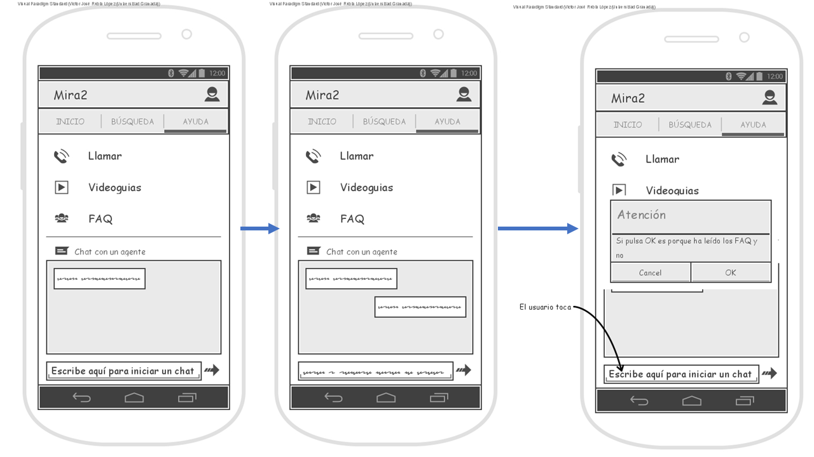
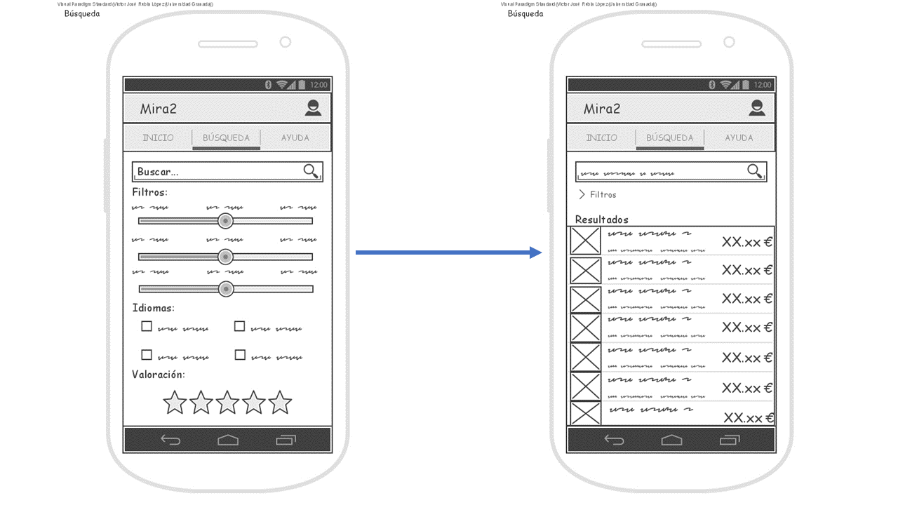
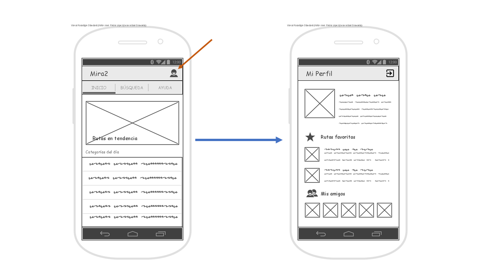

## DIU - Practica2, entregables

## Ideación
### Malla receptora de información 

## Propuesta de valor
Nuestro servicio se llama Mira2 e implementaremos funcionalidades que están relacionadas con: 
- Chat en directo con la organización de la actividad.
- Visualización de los participantes en la actividad.
- Sistema de información de medios de transporte.
### LeanUX Canvas

## Task Analysis
### User/Task flow
Chat de asistencia

Medios de transporte

Visualización de los participantes

## Arquitectura de información
## Sitemap 

## Labelling

Puede consultar la información acerca del labelling en [este documento pdf](https://github.com/VictorRubia/DIU21/tree/master/P2/docs/labelling.pdf)

## Prototipo Lo-FI Wireframe 
Inicio

Apartado de ayuda

Apartado de búsqueda

Vista del perfil

Vista Procedimiento de Reserva de una Ruta

## Conclusiones  
En esta práctica hemos aprendido a hacer una propuesta de diseño mediante la malla receptora de información, en los que vemos ciertos aspectos relacionados con los usuarios de la práctica 1. Posteriormente hemos desarrollado un sitemap para tener organizada la lógica de navegación y los elementos de diseño, por último hemos realizado bocetos de las distintas pantallas de la interfaz siguiendo las directrices del sitemap.
