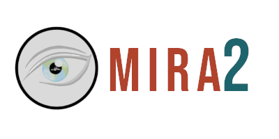
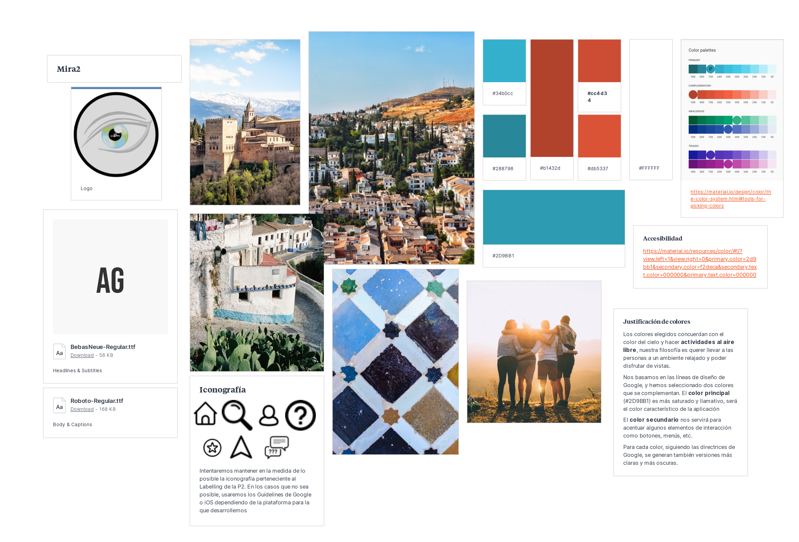
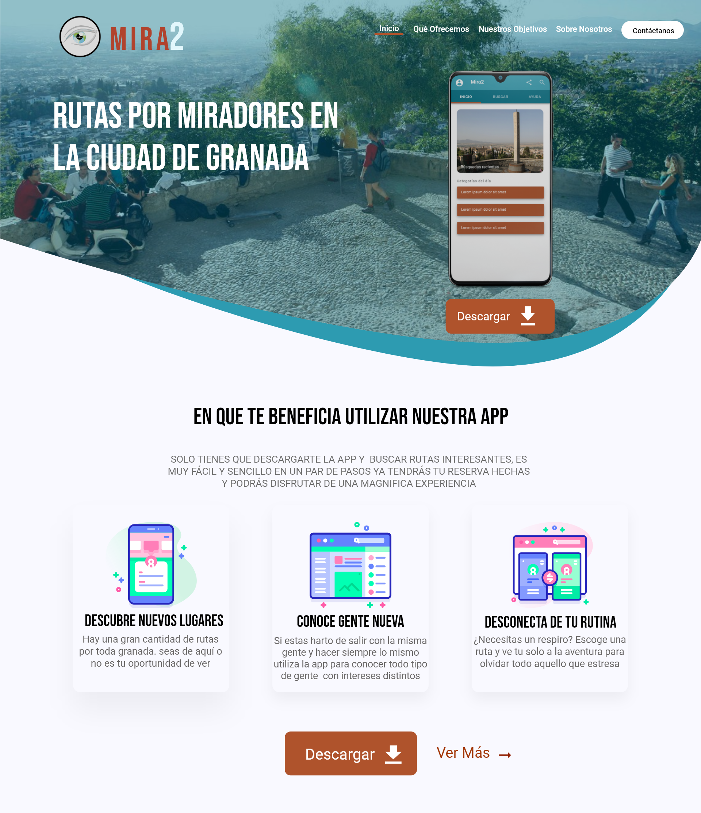
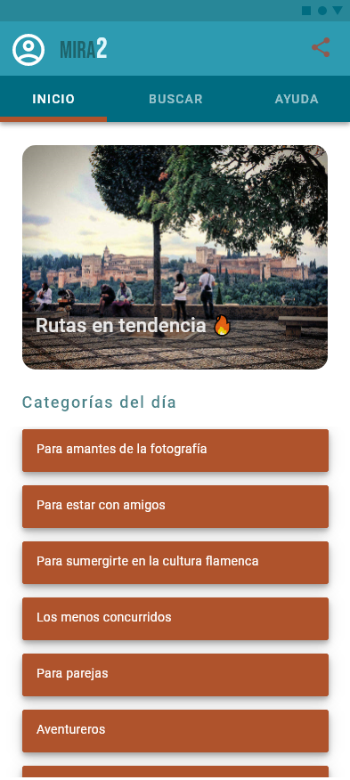
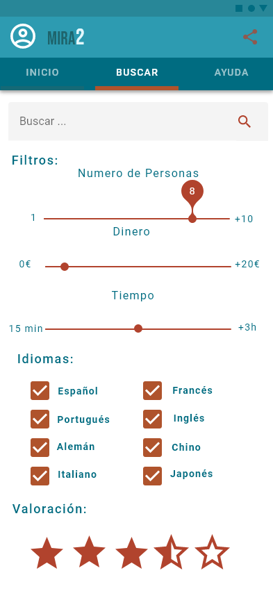
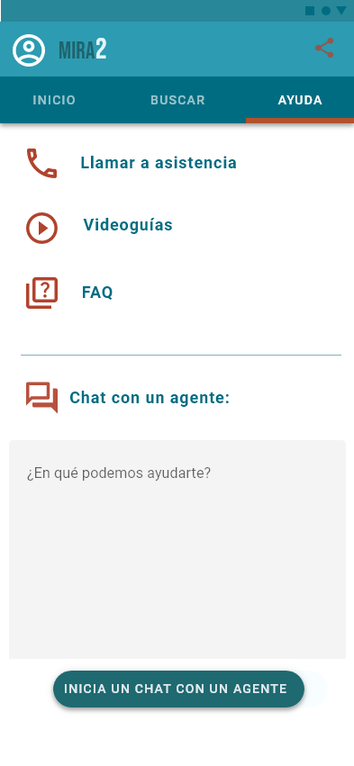
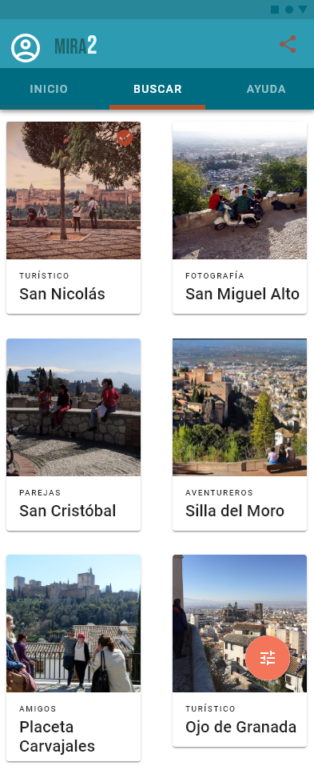
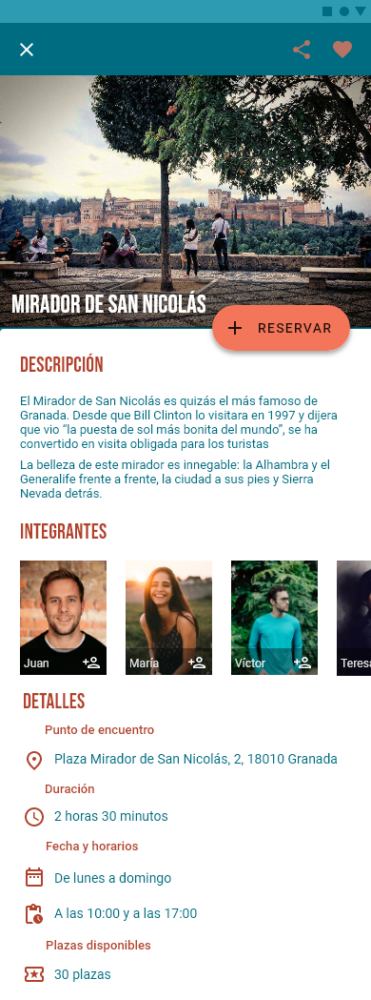

# DIU - Practica 3, entregables

Basándonos en las líneas de diseño de Google para aplicaciones móviles realizaremos el Prototipado y el Mockup. Google nos ofrece una guía muy detallada de diseño y su justificación se puede encontrar en [material.io](https://material.io/design).

### Tipografía

Hemos escogidos dos fuentes para nuestra aplicación.  Para los **títulos, subtítulos, elementos que queramos destacar** utilizaremos la fuente “**BebasNeue**” ya que resulta llamativa para el usuario atrayendo su atención. Para los **cuerpos, el resto de elementos de contenido informativo, botones y elementos interactivos** hemos decidido coger una tipografía más sencilla, no tan expresiva como la anterior para no confundir al usuario, esta es “**Roboto**”. No hemos puesto más fuentes ya que sería excesivo y a lo mejor visualmente menos vistoso  para el usuario incluso molesto.
Estas fuentes las hemos sacado del banco de tipografías que nos proporciona Google,** Google-Fonts.**

### Colores

Nos hemos basado en las **líneas de diseño de Google** y, para ello, hemos escogido dos colores que se complementan cumpliendo los requisitos de la documentación de las líneas de diseño. El **color principal** es más saturado y llamativo, por lo que será el **color característico** de nuestra aplicación. El **color secundario** nos ayudará a acentuar algunos elementos de interacción, tales como botones, menús. barras, etc. Para cada color, se generan también versiones más claras y más oscuras, de acuerdo con las directrices de Google, ya que se usan como color de selección de botón, deselección, etc. Además la [herramienta de Google](https://material.io/resources/color/#!/?view.left=0&view.right=0&primary.color=2d9bb1&secondary.color=f2deca&secondary.text.color=000000&primary.text.color=000000) nos permite conocer qué colores usar según el color de fuente para que el texto sea siempre legible. Para ello, nos indican parámetros como la opacidad mínima que pueden tener los textos. Los colores que usamos son:

- Boston Blue: #2D9BB1 
- Paarl: #B1432D 

### Iconografía

Nosotros intentaremos mantener la iconografía que habíamos utilizado en el **labelling de la práctica dos**. Si por algún motivo no es posible utilizar alguno de estos iconos, los sustituiremos por los **Guidelines de Google o iOS** dependiendo de la plataforma en la que desarrollemos la aplicación.

## Moodboard (diseño visual + logotipo)  

Para diseñar el logotipo hemos usado un iPad y herramientas de composición de imágenes. Además para realizar la palabra Mira2 hemos usado la fuente principal Bebas Neue y hemos jugado con los colores principal y secundario y con el tamaño de letra, enfatizando el 2. La resolución utilizada es 400x200, si necesitamos usarla en distintos sitios siempre se puede cambiar el color de la fuente accediendo al archivo fuente del diseño.

Logotipo:

## Moodboard (diseño visual + logotipo)   

## Landing Page

Para la realización de la página promocional hemos incluido un título atractivo en dos colores, usando la gama que hemos seleccionado en el moodboard. El elemento gráfico que refuerza nuestra idea es la gran imagen de encabezado que representa un mirador de Granada, donde hay gente divirtiéndose y pasando un agradable rato. En la parte media del landing page tenemos las características de los beneficios de nuestro servicio. Además como acción principal y la que más resalta es un botón de Descarga a nuestra aplicación.

## Mockup: LAYOUT HI-FI

|  Inicio | Buscar |  Ayuda |
|---|---|---|
|   |   |   |

|  Lista de actividades | Actividad  |
|---|---|
|   |   |

## Documentación: Publicación del Case Study

(incluye) Valoración del equipo sobre la realización de esta práctica o los problemas surgidos
Al comienzo de esta práctica comenzamos eligiendo colores y tipografías que nos gustasen, sin embargo, en los siguientes apartados, al tener que seguir un Guideline y elegir el de Material Design, nos dimos cuenta de que teníamos que cambiar nuestra primera elección y adaptarla a las guías de Material Design. Ya teniendo en cuenta la guía de estilo, nos fue bastante sencillo el elegir colores y tipografías ya que disponen de herramientas para facilitar la selección de los mismos.
  
